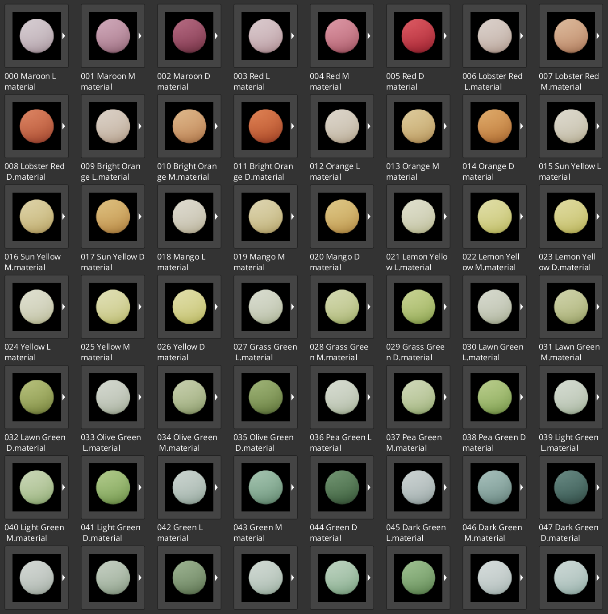

# O3DE_BasicMaterialColours
A collection of over 100 flat coloured materials.

## Setup
1. Clone or Download the Repository
2. "Add Existing Gem" in the O3DE Project Manager.
    1. Alternative: Directly add the Repo to the Repository List.
        1. `ProjectManager -> Gems -> Menu -> Show Gem Repos -> Add Repository`
        2. Url: `https://github.com/GenomeStudios/O3DE_BasicMaterialColours`
3. Edit your Project Gem Configuration.
4. Enable the Basic Material Colours Gem!

> [!NOTE]
> The Preview Icons in Editor look far lighter than the actual Material.